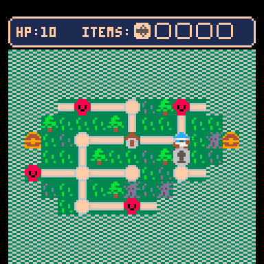

# Tumbert's Quest
A tiny action game in vein of Megaman Battle Network made in Pico8. 

Fight little guys on a grid! Acquire and use special attacks! Fight a boss! Rescue your ailing rat!

[Play it here!](https://addisonmink.github.io/tumberts-quest/tumbert.html)

## Controls
* Move with directional buttons.
* X - basic attack/confirm.
* O - use item/cancel.
* In item select screen: hold left or right to view enemies.